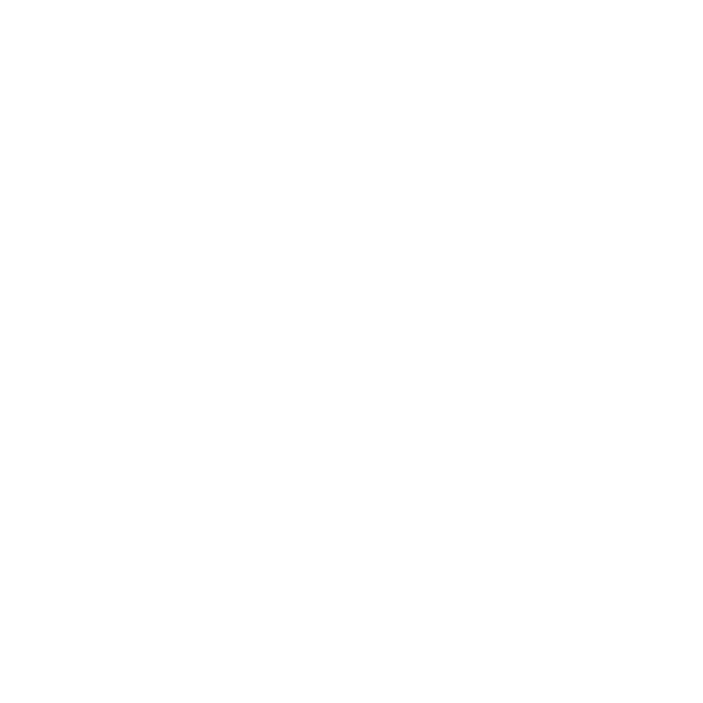

# Ligados Online 🎹🎓

Plataforma educativa musical especializada en la conexión en tiempo real, diseñada para clases de música remotas con alta interactividad.



## 🚀 Características Principales

-   **Videollamada Integrada**: Comunicación fluida para clases 1 a 1.
-   **Pizarra Virtual Interactiva**:
    -   Herramientas de dibujo estilo "Excalidraw".
    -   Sincronización en tiempo real vía Socket.IO.
    -   Resistente a cambios de diseño (Responsive).
-   **Piano MIDI Virtual**:
    -   Soporte para **Web MIDI API**: Conecta tu teclado físico y toca en tiempo real.
    -   Visualización de notas locales y remotas (profesor/alumno).
    -   Selector de dispositivos MIDI (Entrada/Salida).
-   **Gestión de Sala**:
    -   Generación de códigos de sala únicos.
    -   Temporizador sincronizado para ejercicios.
-   **Diseño Premium**: Interfaz moderna, responsiva y adaptada a la identidad corporativa.

## 🛠️ Tecnologías

-   **Backend**: Node.js, Express.
-   **Real-Time**: Socket.IO (Señalización y sincronización de estado).
-   **Frontend**: HTML5, CSS3 Moderno (Variables, Flexbox, Grid), Vanilla JavaScript.
-   **Multimedia**: WebRTC (Video/Audio), Web MIDI API.

## 📦 Instalación y Uso

1.  **Clonar el repositorio**:
    ```bash
    git clone https://github.com/tu-usuario/ligados-online.git
    cd ligados-online
    ```

2.  **Instalar dependencias**:
    ```bash
    npm install
    ```

3.  **Iniciar el servidor de desarrollo**:
    ```bash
    npm run dev
    ```
    El servidor iniciará en `http://localhost:3000`.

## 🎨 Estructura del Proyecto

*   `public/`: Archivos estáticos (HTML, CSS, JS, Assets).
    *   `css/`: Estilos globales y componentes.
    *   `js/`: Lógica del cliente (`whiteboard.js`, `piano.js`, `settings.js`, `webrtc.js`).
    *   `img/`: Recursos gráficos.
*   `server.js`: Servidor principal y lógica de Socket.IO.

## 🤝 Contribución

Proyecto privado desarrollado para Ligados Online.
